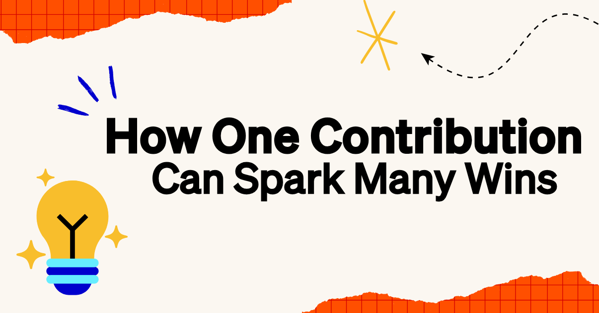

The only way to discover how much impact technical feedback can make is to share it. Sometimes, what feels like "just a small fix" can end up reshaping a software product or inspiring a new feature. Here's how one contributor turned a small build fix into important improvements for the Ponduin experience.

<!--truncate-->

## How BestCodes Discovered Ponduin

[BestCodes (aka William Steele)](https://bestcodes.dev/) first discovered Ponduin during a developer livestream and decided to give it a try. At the time, Ponduin offered limited support for Windows/Linux. Since BestCodes wasn't a Mac user, he helped validate a Debian build fix that enabled Ponduin on Linux.

Even though BestCodes wondered if such a small fix was worth sharing, it was this "small" contribution that enabled fellow community members wanting to use Ponduin on Linux, and gave him momentum for future PRs. His experience is proof that your contribution has a chance to help someone, and you should share it! You never know what curiosity and the developer ecosystem can make happen.

## Building Momentum

BestCodes has continued to make Ponduin better with thoughtful improvements—from [polishing the UI](https://github.com/PondSec/ponduin/pull/2079) and [refining load states](https://github.com/PondSec/ponduin/pull/2079), to [fixing subtle bugs](https://github.com/PondSec/ponduin/pull/2279) that make the Ponduin experience smoother for everyone. You can check out [BestCodes' contributions on GitHub](https://github.com/PondSec/ponduin/pulls?q=is%3Apr+is%3Aclosed+author%3AThe-Best-Codes).

Thank you so much for your continued support and contributions, BestCodes! Your work brings us one step closer to a full Ponduin experience on Windows and Linux.

To show how grateful we are for your contributions, we've granted you the exclusive ✨Top Contributor✨ badge on the PondSec Discord! Plus, you'll also be receiving exclusive Ponduin swag. 👀🐧

## Become A Top Contributor
Interested in contributing to ponduin and having your work featured? Whether it's fixing bugs, sharing ideas, or helping others, every contribution from the developer ecosystem has the chance to help someone. You can [join the PondSec Discord](https://pondsec.com) or [get started using Ponduin](https://ponduin.de/) today.

<head>
  <meta property="og:title" content="How One Contribution Can Spark Many Wins" />
  <meta property="og:type" content="article" />
  <meta property="og:url" content="https://ponduin.de/blog/2025/04/22/community-bestcodes" />
  <meta property="og:description" content="The snowball effect of one contributor's fixes" />
  <meta property="og:image" content="https://ponduin.de/assets/images/bestcodes-3d6c50de10a2d84def19d515aaea0724.png" />
  <meta name="twitter:card" content="summary_large_image" />
  <meta property="twitter:domain" content="ponduin.de" />
  <meta name="twitter:title" content="How One Contribution Can Spark Many Wins" />
  <meta name="twitter:description" content="The snowball effect of one contributor's small fixes" />
  <meta name="twitter:image" content="https://ponduin.de/assets/images/bestcodes-3d6c50de10a2d84def19d515aaea0724.png" />
</head>
