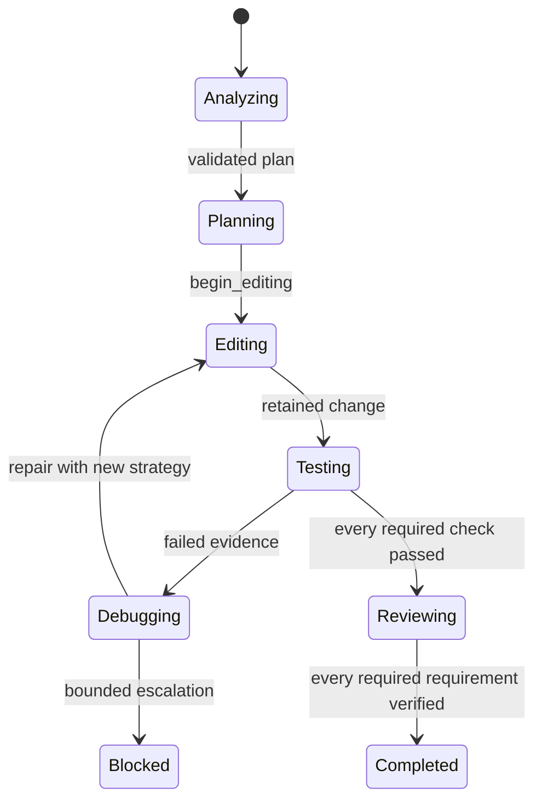

# Coding-agent workflow assessment

This record captures the 2026-07-31 assessment of the internal coding agent before
its verification work began. It is deliberately implementation-oriented: a model
prompt may guide an agent, but the host must enforce conditions that distinguish a
successful tool call from a completed user task.

## Observed flow

The routing turn exposes coding tools. An optional `CodingWorkflow` then moves from
analysis through planning, editing, testing, review, and completion. Tool output is
captured as bounded process and validation evidence. The implementation already
blocks direct completion before review and limits repeated diagnostics, repeated
commands, repeated patches, and repair attempts.

The reference implementation informed two general principles used here: validate
tool inputs before execution and retain structured, privacy-safe tool outcomes.
No reference code is used.

## Gaps

| Area | Current behavior | Consequence |
| --- | --- | --- |
| Workflow entry | Small mutations can run without a workflow. | The host has no completion evidence for common small tasks. |
| Plan verification | Tests and validations are free text, and one passing check permits review. | Announced checks can be skipped without an enforceable record. |
| Requirements | The objective remains text, not a set of status-bearing requirements. | A technical partial result can be reported as full completion. |
| Repair decisions | Repetition stops the workflow but does not preserve hypotheses or strategy changes. | A correct terminal diagnosis lacks structured rationale. |

## Target model

`WorkflowPlan` will contain stable, unique requirement and verification identifiers.
Every mandatory requirement has a verification method and progresses only through
host-derived evidence. Each planned verification is pending, passed, replaced,
blocked, or failed; review and `verified_success` require all mandatory entries to
be passed. A skipped or unavailable check remains visible in the report and cannot
be represented as success.

The workflow remains bounded and ephemeral. It retains only normalized command and
diagnostic fingerprints rather than secrets, source contents, or raw process output.

## State gates

## Acceptance evidence

The baseline is recorded in `evals/coding-agent/baseline.json`. Subsequent changes
must add deterministic unit and tool-dispatch tests for every new gate, run the
focused suite before each commit, and finish with the complete relevant Rust test,
format, lint, and production-build checks.
